# Express源码系列之全局一览

### 本系列目录

##### 1. 全局 （本文）

##### 2. 路由匹配

##### 3. 错误处理

##### 4. 视图模板

##### 5. 设计思想

### 线索一：入口

​		Express使用足够简单，整体来说就是设置路由及对应的中间件，中间件流处理req，res两个对象，最后将结果返回，以Express 脚手架生成的模板为例：

#### 1. 程序的入口为bin/www.js


**总结：**

1. **导入app作为http.createServer方法的参数**
2. **监听端口**

#### 2. 原生的http.createSerevr方法使用回顾

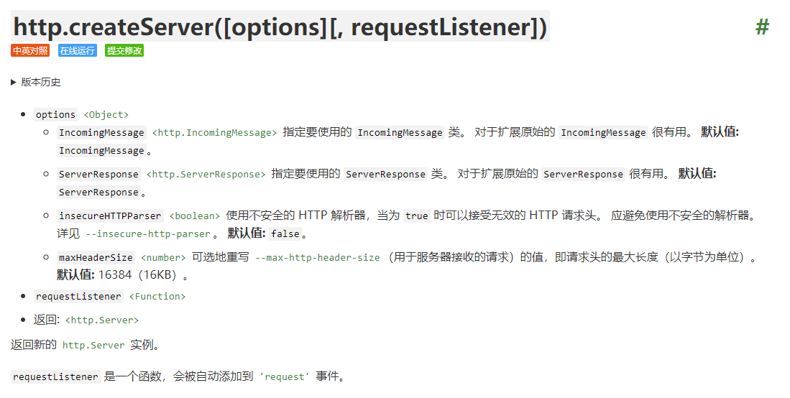


​	那问题来了，参数是app，那是不是就是说app就是options呢？让我们看看，根目录下的app.js文件到底导出了个什么玩意

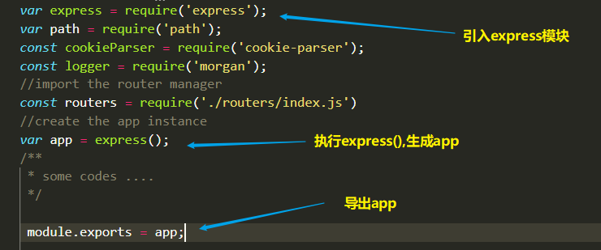

​	**可以看到，app是由执行express方法生成的，此时此刻就只能到express模块的源码看看了**

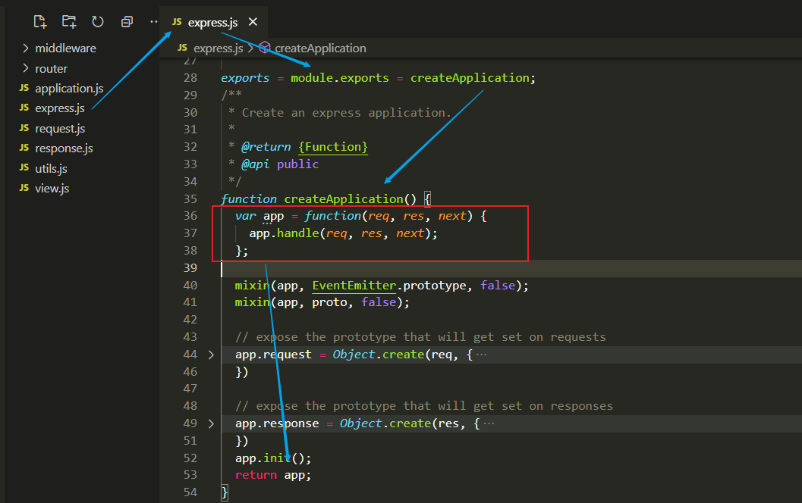

##### 	显然导出的app是一个函数，但http.createServer要求options是对象，那传进去一个函数会怎么样呢？为了追求刺激，那只能贯彻到底咯~，为一探究竟，我追到了node源码

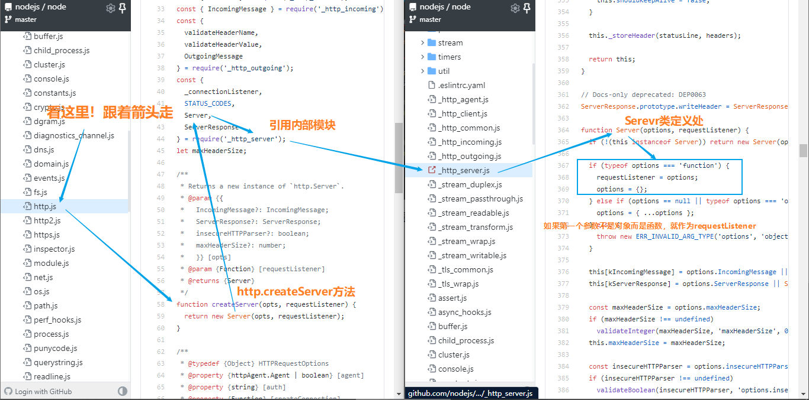

破案了，app方法是作为**callback**传进http.createServer去的

总结：

1. express模块导出一个函数app
2. app函数被作为http.createServer方法的requestListener参数传入,用于监听‘request’事件

#### 线索一到此为止，可以看到，每当有请求到达，request事件就会触发，request，response两个原生对象就会被作为参数传进app

**番外：request事件**


---


### 线索二：面向对象

​		JS不像我们，人家是有对象的，这也是大部分框架的主要主力点  --- 基于几个重要对象构建整个框架，不过在JS中，一定要记着，函数也是对象，即使拥有自己属性和方法的函数叫做构造函数，不过本质上并没有多大区别，反而**函数对象莎莎分不清楚 + this乱指 + 各种原型Mixin**会对源码的阅读造成很大的障碍，不过**面向对象的阅读**也许是一条正确的道路

#### 1. Express中的 对象 or 构造函数

1. app对象

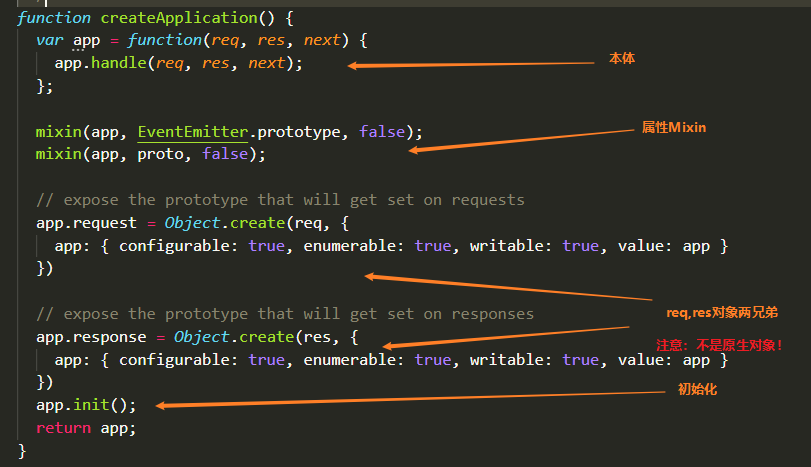

可以看到，app出身贫寒，只是个函数，但经过两次属性Mixin装备升级之后，拥有了无上神力，其中EventEmitter.prototype的Minix是让app具有on事件，emit事件等一系列事件相关的能力，proto的Mixin则是express专属能力，为了节省时间，我总结了下proto的Mixin到底mixin了什么

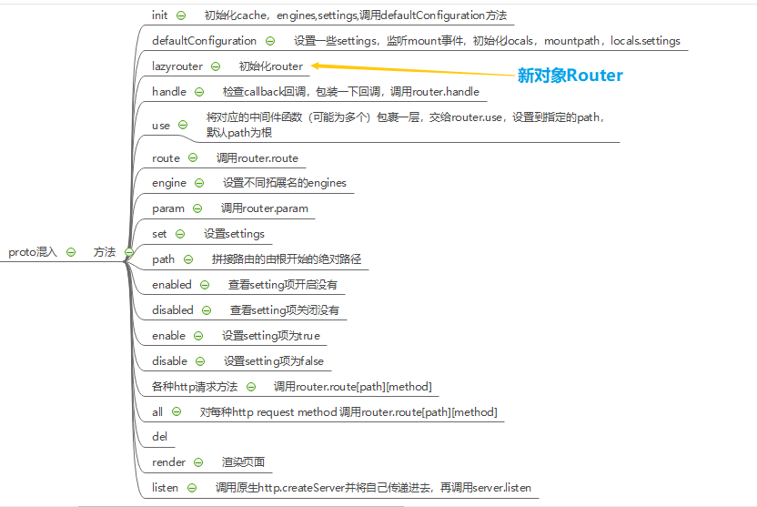

具体的细节先不管，记住我们的策略-面向对象，找出现的对象，新加入的Router对象是何方神圣？让我们一探究竟

##### 2. Router对象

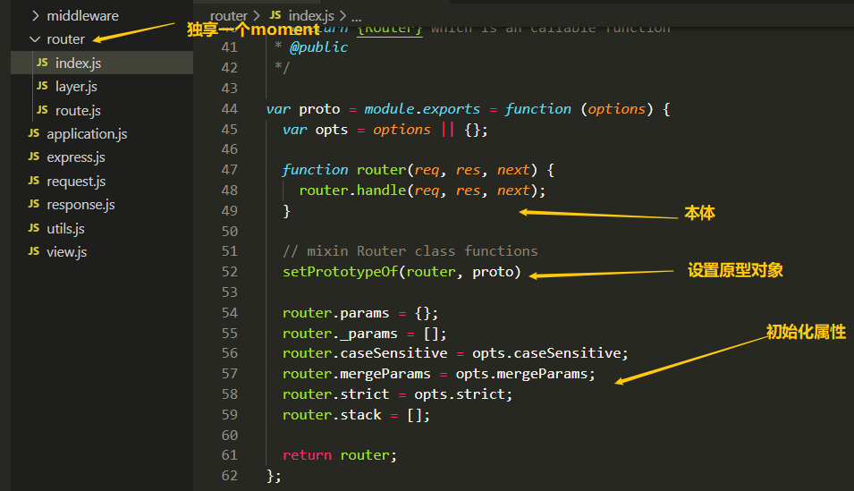

Router对象略显尊贵，单独拥有一个文件夹，座下还有layer，route两大弟子，可以看到，router本体也是一个函数，长得不能说和app一摸一样，可以说是毫无差别，也是经过原型对象1对1传功增强，顺其自然，我们就要看proto原型到底传了什么功给他。

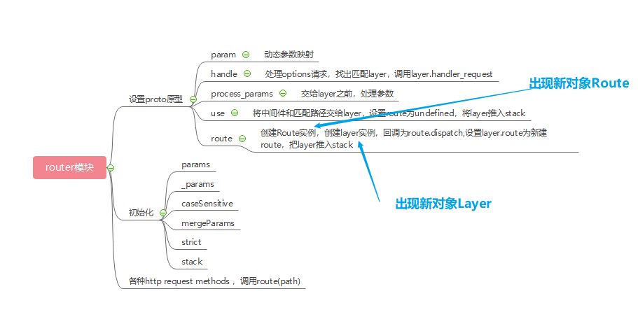

老规矩，具体细节不管，看看新出的route，layer两大弟子是何方神圣，既然都是router的大弟子，那就一起看了

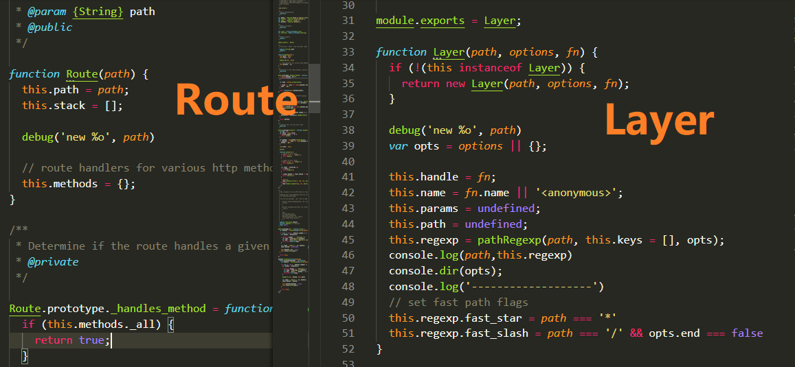

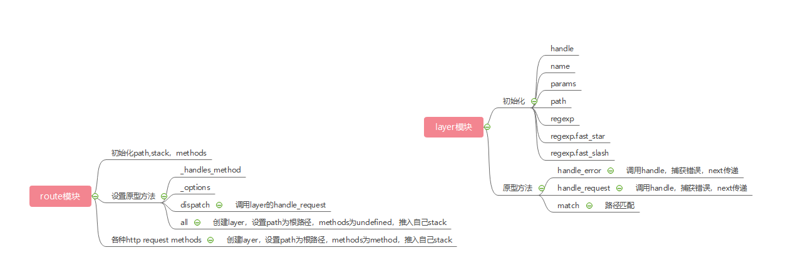

到目前为止，信息量有点大，忽略了很多细节，但基本的**四个重要对象**都已经出场了，让我们先给他们起个名字，好理解他们的职责，线索三中会讲他们之间的相互作用。

app ---> 伊丽莎白·阿婆（app）

router ---> 首相 鲍里斯·肉特尔 （router)

route ---->  首相儿子 鲍里斯·肉特 （route)

layer ---->  打工人 无姓氏·雷亚 （layer)

为什么要起这些名字呢? 我说是乱起的，我可不是乱起的啊~！

**伊丽萨白阿婆主要负责和外界交流，向外界暴露接口，具体接口功能由router提供**

**首相肉特尔负责请求路径路由调度和中间件管理**

**首相儿子肉特负责具体请求方法路由的调度，比如说get路由，post路由**

**雷亚打工人就负责实打实的干实事，有3种layer，分别出现在不同地方，分别是**

1. **中间件layer，位于router.stack，负责一级layer流处理**
2. **传信layer，位于router.stack，route的傀儡，负责给route传递信息**
3. **散工layer，位于route.stack,  负责特定路由的真实处理**

后文会细细说来

基本关系如图，同样会在后文解析，先形成印象

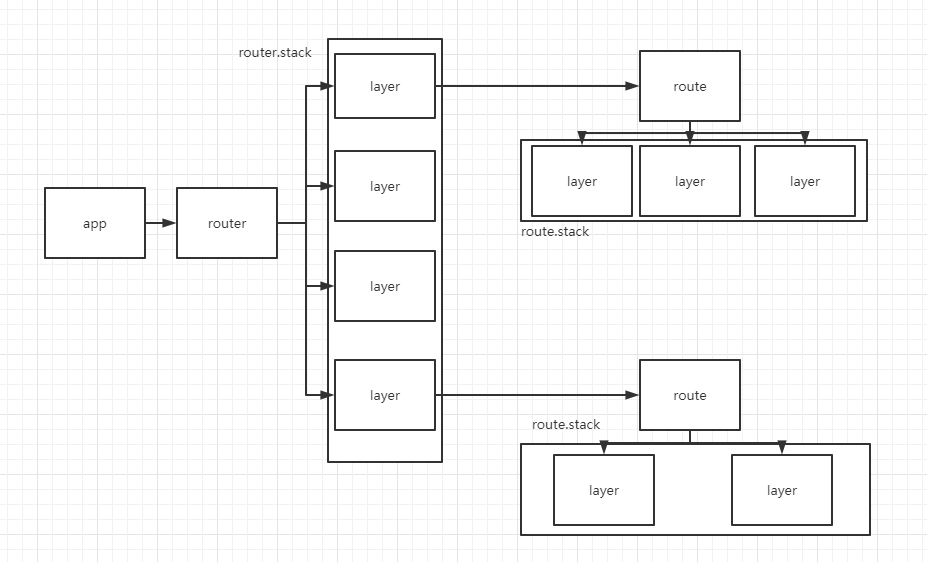

---


### 线索三：黎明前的准备

​		实际的应用中，在请求到来之前，我们是要做很多初始化的工作的，以Express脚手架生成的项目模板为例，如下图，我们会在监听之前，添加中间件和设置一些东西

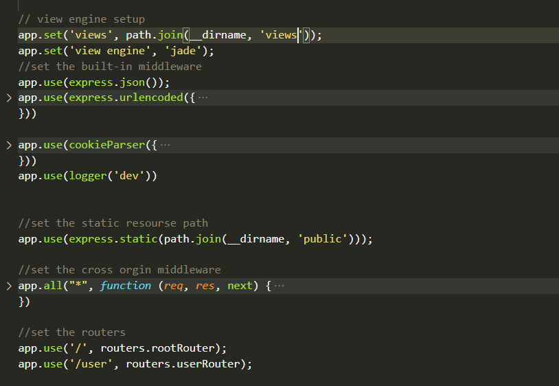

（app.set是用于设置app.settings的，这里先不做分析）这里就会用到app.use和app.all两个方法，相同的还有app.get,app.post....等等，无一例外，这些方法都与整个程序的路由解析息息相关。

通过分析源码（源码我就不贴了，直接说结果了）我们可以发现，如下的调用流程：

1. app.use 调用  router.use ，router.use创建 layer 并将其推入router自己的stack
2. app.all 对于每种method调用 router.route ，router.route 方法创建一个layer对象，一个route对象，将两者关联， 再返回route对象，最后再调用 route()
3. app[method]对指定method执行第2点

总结如下

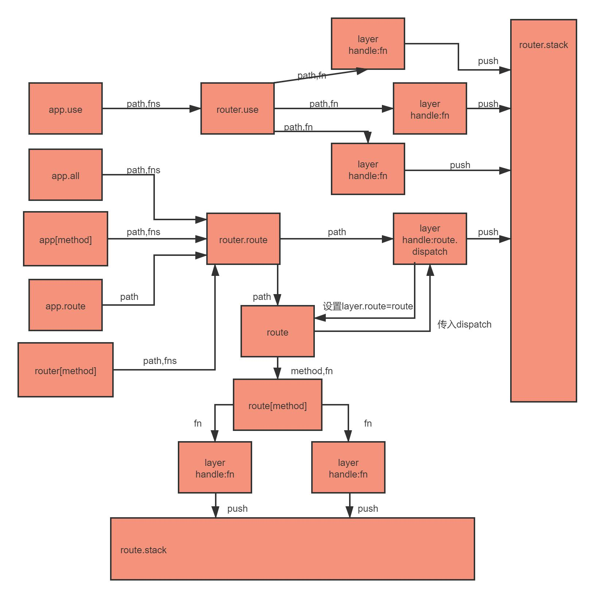


##### 		可见，对于每一次app.use/app.all...等操作，都会生成至少一个layer，其中没有指定method的话就会生成全局layer，归app._router也就是全局路由器管理，指定了method的话，就会生成route去管理，此时也会push一个全局layer，不过这个layer的handle是route.dispatch，而route.dispatch方法则是调用route.stack的layer去做具体事情，等下看到后面就明白了，现在先确定，route也有自己的stack

那router.stack和route.stack有什么用呢？这就是express的核心之一，中间件机制原理。线索四详细道来，线索三先告一段落。

##### 番外：干实事的layer对象都有哪些属性

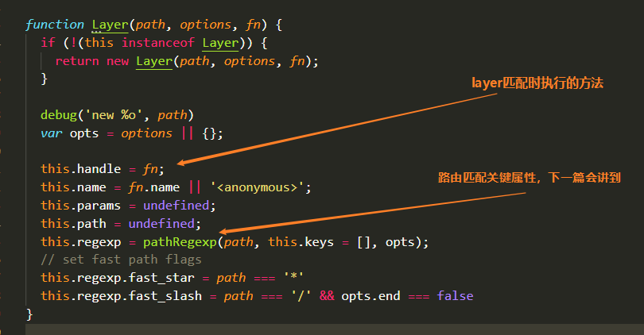

---


### 线索四：全军出击

​	经过了漫长的前期初始化和准备，程序拥有了处理http请求的能力，让我们随着一次http请求，来看看express是怎么应对的。

​	在入口中，我们得出结论，当http的request触发时，app会被作为callback来处理这个事件，同时获得两个参数，原生req对象和原生res对象。

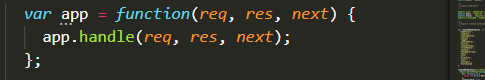

app会在内部调用app.handle,此时参数中是没有next，换而言之，next是undefined

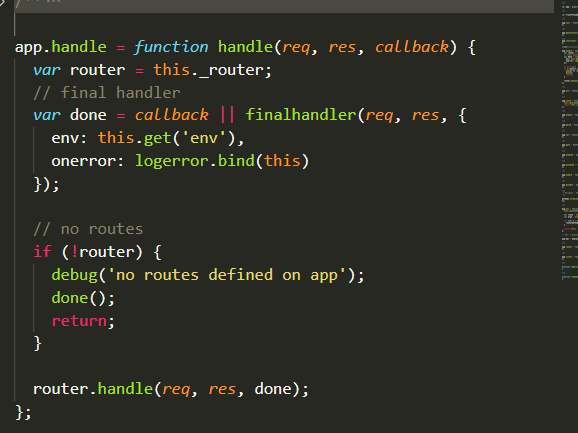

​	因为callback是undefined，所以done会被包装成finalhandler,这个函数不用理会，最后检查下有无设置router，当然了，router是在调用app.use/app.all那些接口才会延时创建，没有router就说明没有要处理的中间件函数，此时直接返回就行了，有router就调用router.handle,这个函数才是重中之重，著名的next方法原型就是定义在其中（route.dispatch中也有，这是后话了）

比较长，不贴照片了，不想看的可以跳到总结

```javascript
proto.handle = function handle(req, res, out) {
  var self = this;
  debug('dispatching %s %s', req.method, req.url);
  var idx = 0;
  var protohost = getProtohost(req.url) || ''
  var removed = '';
  var slashAdded = false;
  var paramcalled = {};
  // store options for OPTIONS request
  // only used if OPTIONS request
  var options = [];
  // middleware and routes
  var stack = self.stack;
  // manage inter-router variables
  var parentParams = req.params;
  var parentUrl = req.baseUrl || '';
  var done = restore(out, req, 'baseUrl', 'next', 'params');
  // setup next layer
  req.next = next;
  // for options requests, respond with a default if nothing else responds
  if (req.method === 'OPTIONS') {
    done = wrap(done, function (old, err) {
      if (err || options.length === 0) return old(err);
      sendOptionsResponse(res, options, old);
    });
  }
  // setup basic req values
  req.baseUrl = parentUrl;
  req.originalUrl = req.originalUrl || req.url;
  next();
  function next(err) {
    var layerError = err === 'route' ?
      null :
      err;

    // remove added slash
    if (slashAdded) {
      req.url = req.url.substr(1);
      slashAdded = false;
    }

    // restore altered req.url
    if (removed.length !== 0) {
      req.baseUrl = parentUrl;
      req.url = protohost + removed + req.url.substr(protohost.length);
      removed = '';
    }

    // signal to exit router
    if (layerError === 'router') {
      setImmediate(done, null)
      return
    }

    // no more matching layers
    if (idx >= stack.length) {
      setImmediate(done, layerError);
      return;
    }

    // get pathname of request
    var path = getPathname(req);
    if (path == null) {
      return done(layerError);
    }

    // find next matching layer
    var layer;
    var match;
    var route;

    while (match !== true && idx < stack.length) {
      layer = stack[idx++];
      match = matchLayer(layer, path);
      route = layer.route;

      if (typeof match !== 'boolean') {
        // hold on to layerError
        layerError = layerError || match;
      }

      if (match !== true) {
        continue;
      }

      if (!route) {
        // process non-route handlers normally
        continue;
      }

      if (layerError) {
        // routes do not match with a pending error
        match = false;
        continue;
      }

      var method = req.method;
      var has_method = route._handles_method(method);

      // build up automatic options response
      if (!has_method && method === 'OPTIONS') {
        appendMethods(options, route._options());
      }

      // don't even bother matching route
      if (!has_method && method !== 'HEAD') {
        match = false;
        continue;
      }
    }
    // no match
    if (match !== true) {
      return done(layerError);
    }

    // store route for dispatch on change
    if (route) {
      req.route = route;
    }

    // Capture one-time layer values
    req.params = self.mergeParams ?
      mergeParams(layer.params, parentParams) :
      layer.params;
    var layerPath = layer.path;

    // this should be done for the layer
    self.process_params(layer, paramcalled, req, res, function (err) {
      if (err) {
        return next(layerError || err);
      }

      if (route) {
        return layer.handle_request(req, res, next);
      }

      trim_prefix(layer, layerError, layerPath, path);
    });
  }
}
```

​		粗略来看的话，router.handle就是一个**闭包**，每次请求执行一次，这个闭包的作用是保存一些请求层面上的全局变量，比如说params，baseUrl等等，然后拿到这次请求的路径去到自己的stack中进行layer的匹配，匹配到的话，就执行layer.handle，匹配不到的话就执行done，也就是finalhandle函数，同时将next传进去，因为next作为一个闭包函数，引用的变量都是定义在router.handle中的变量，如果调用next函数，相当于，把控制权还给router.handle,继续在router.stack中匹配下一个，这就是中间件的原理。

​		大体上流程就是上述那样，但因为layer种类的不同，就会有不同的handle函数，比如说有的handle就是中间件有的handle就是route.dipatch，那如果匹配到的是后者会怎么样呢？

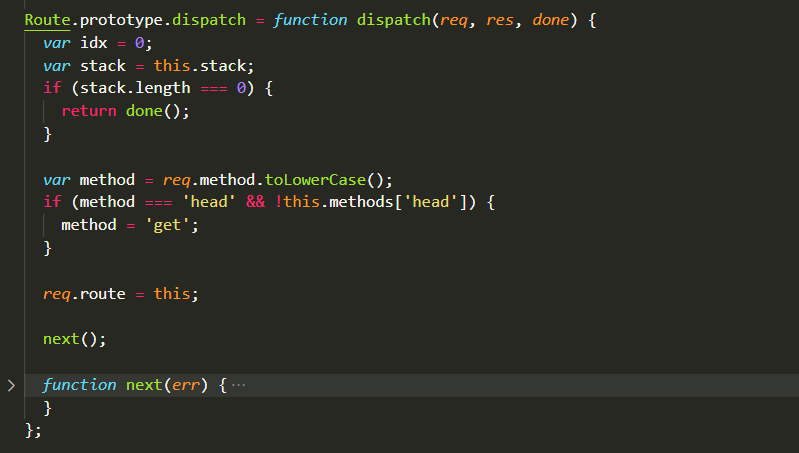

估计你也猜到了，route.dispatch简直跟router.handle长得一摸一样，那就好理解了，当在router.stack中匹配到handle是route.dispatch的layer，route.dispatch就会执行，执行的结果就是拿到method和path去匹配自己的stack中的layer，匹配到没有匹配的layer的时候就返回到router.stack中，相当于新开了一棵递归树。

---


### 总结

#### express主要由app，router，route，layer四种对象组成，app负责对外暴露接口和管理全局属性如路由器，视图模板等，router拥有自己的stack，负责调度全局中间件layer和dispatch layer，route负责管理指定请求方法的中间件layer，layer代表中间件，不过有三种类型，全局，dispatch，handle，其中handle layer就是我们常写的

```javascript
router.get('/',function(req,res,next)=>{
})
```

#### 当然，这可以看作是中间件，不过一般都会在这里返回http响应，故称之handle layer。


全局一览篇就到此为止了，下一篇 **路由匹配** 将深入请求到达，路径匹配，动态params的一切细节，敬请期待！


