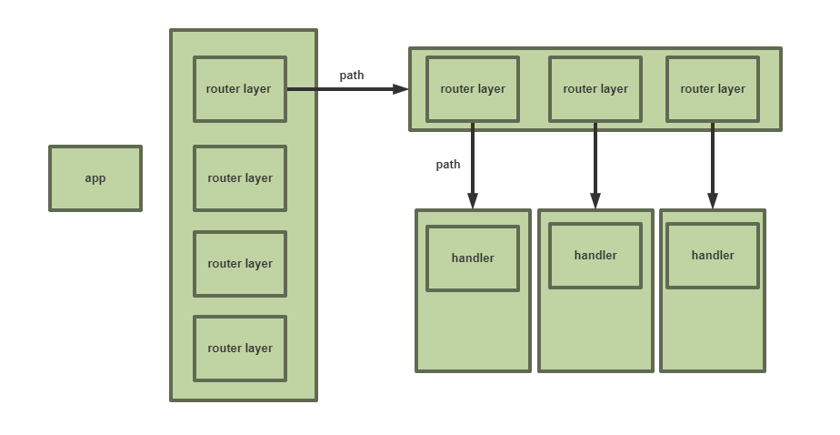

#### 1. 万物皆是中间件

​	在Express的世界里，所有东西都可以作为中间件，所有的中间件就像是叠大饼一样，叠在一起，每个中间件通过共享的req，res对象进行数据沟通（有需要的话），一般都是不沟通的，各玩各的，你以为router就只能是router？app只能是app？app只能use router?

​	**格局小了**

1. app use app

   ```javascript
   var app = express();
   const app2 = express();
   app2.use('/', function (req, res, next) {
     res.end('app2');
   })
   app.use('/app2', app2);
   ```

2. router use router

   ```javascript
   var express = require('express');
   var router = express.Router();
   var router2 = express.Router();
   router2.use('/', function (req, res, next) {
     res.end('router2')
   })
   /* GET home page. */
   router.get('/router2', router2);
   ```

3. router use app

   ```javascript
   var express = require('express');
   var router = express.Router();
   var app = express();
   app.use('/', function (req, res, next) {
     res.end('app');
   })
   router.get('/', app);
   ```

当然，没十年老血栓写不出这样的嵌套，这些只是说明Express只是实现了一个小型的服务器系统，完全可以由这些个小型系统组合成大型的服务器应用，按照各部分写成一个app，再用一个全局app来use

#### 2. 顺序执行的中间件

​	众所周知，Express的中间件是一个接着一个执行的，上一个不调用next，下一个再怎么尿急也执行不了，而且执行的顺序严格按照use顺序来，就是代码的位置都会影响执行顺序，这就要求中间件各司其职，只负责自己的那部分，不要跟其他中间件耦合，只有这样才能会略顺序带来的影响，就像交换律一样。  

#### 3. 问题

​	顺序执行流程简单，但也会出现很多问题

##### 1. 被截胡

​     任何一个中间件都可能直接调用res.end,从而终止流程。

```javascript
//截断
app.use('*', (req, res) => {
  res.end('截胡')
})
//set the routers
app.use('/', routers.rootRouter);
app.use('/user', routers.userRouter);
```

##### 2. 宇宙毁灭也轮不到

​	简单理解，上一个中间件出现死循环

```javascript
app.use('*',function(req,res,next){
    //独享整个moment
    while(true){
        drink();
        eat();
        play();
    }
})
app.use('/',function(req,res,next){
    req.help = true;
    next();
})
```

##### 3. 毁灭地球

```javascript
app.use('*', function (req, res, next) {
  delete req.app.res
  delete req.app
  Object.freeze(req);
  next();
})
app.use('/', routers.rootRouter);
app.use('/user', routers.userRouter);
```

#### 4. 最佳路由编写（个人认为）

​	因为router可以use router，所以编写嵌套路由的时候就可以根据路由的分级，嵌套router，而每个router又是搭载了完整中间件机制的，完全可以依此嵌套use下去



#### 尾声

​	Express源码系列完，起初是因为接触的第一个node端服务器框架是Express，然后看到源码行数也不多，才决定研究研究的，前后耗时一周，才疏学浅，写的也比较浅，望多包涵！