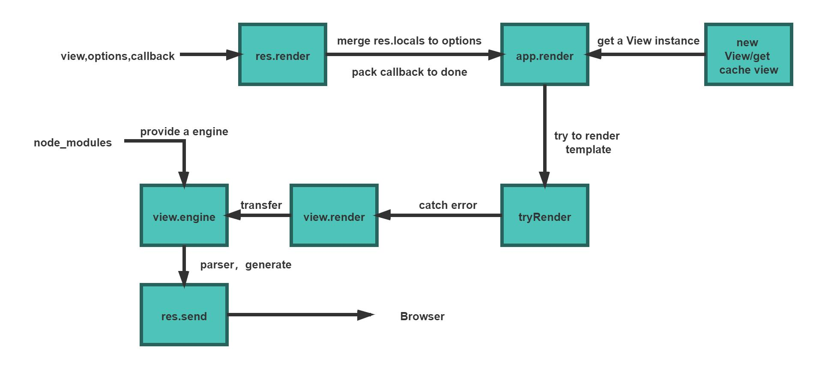
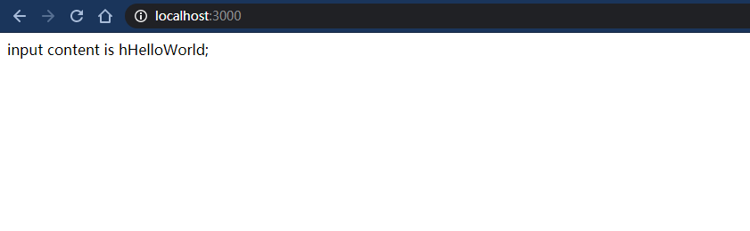

#### 1.关于视图模板引擎

​	初始听到引擎这个词，感觉又是什么高大上的厉害之物，其实简单来说就是负责将数据注入到静态模板中的工具而已。


（图片来源网络，如侵权联系，马上删除）

​	javascript的模板引擎主要战场是浏览器和node端，两端其实差不多，常用的就是jade，ejs，art-template，

而art-template号称无敌超级霹雳旋风快，有空研究下他们具体实现的异同，现在先不管。

​	

#### 2. Express与视图模板引擎

​	差点忘了本文是Express源码系列，还是回到Express，其实模板引擎已经是存在很久了，一下说不完。

##### 2.1 准备阶段

​	关于视图模板的初始设置大部分是放在app.settings对象中，相关属性有 

+ view    管理视图模板的类，一个实例对应一种视图模板

+ views   视图模板文件存放的路径

+ view engine   默认的视图模板引擎名称

  还有一个关于视图模板的引擎类型的属性，单独放在app.engines对象中

##### 2.2 视图模板的使用

​	首先设置view，view engine设置项

```javascript
app.set('views', path.join(__dirname, 'views'));
app.set('view engine', 'jade');
```

​	然后直接调用res.render('模板文件名')直接进行渲染就好，比如渲染并返回error页面

```javascript
// error handler
app.use(function (err, req, res, next) {
  // set locals, only providing error in development
  res.locals.message = err.message;
  res.locals.error = req.app.get('env') === 'development' ? err : {};
  // render the error page
  res.status(err.status || 500);
  res.render('error');
});
```

另外还有一个不常用的接口也暴露在app对象上

```javascript
app.engine = function engine(ext, fn) {
  if (typeof fn !== 'function') {
    throw new Error('callback function required');
  }

  // get file extension
  var extension = ext[0] !== '.' ?
    '.' + ext :
    ext;

  // store engine
  this.engines[extension] = fn;

  return this;
};
```

​	其主要作用就是设置对应拓展名的视图模板文件怎么渲染，在文末会稍微写一个简单的视图模板引擎，并利用这个接口来定义渲染操作。

##### 2.3 详细过程

​	视图模板作为静态html文件的主要生成工具，在Express上唯一暴露的使用接口就是res.render,所以我们就从这个函数看起

```javascript
res.render = function render(view, options, callback) { //codes... }
```

​	可以看到，他的参数有三个，其中view参数是必选的,是要渲染的模板文件的名字，剩下的两个是可选的，内部会根据参数数量进行包装,其中view还是view，opts将传进的options和response对象的locals属性进行了合并，done参数是传入的，可选的，接收模板最后输出的字符串的函数，如果不传入就会简单的包装成如下

```javascript
 done = done || function (err, str) {
    if (err) return req.next(err);
    self.send(str);
 };
```

​	最后会调用app.render并传入包装好的新的三个参数

```javascript
// render
app.render(view, opts, done);
```

​	在app.render中会再次对opts选项进行合并，将一些全局的属性合并进去，最后生成一个renderOptions对象，该对象表示一次模板渲染的所有选项。同时在这里，还会生成模板文件管理实例，也就是前面说过的View的一个实例，这个实例管理这个名字的模板文件和对应解析引擎之间的映射关系，如果这个管理实例有被缓存，就会直接在缓存中取。最后将view实例，renderOptions对象，和包装的done函数传给，tryRender函数

```javascript
// render
tryRender(view, renderOptions, done);
```

而tryRender函数只是进行错误捕获，内部直接调用view,render，并传入renderOptions和done

```javascript
function tryRender(view, options, callback) {
  try {
    view.render(options, callback);
  } catch (err) {
    callback(err);
  }
}
```

​	刚才说过，管理实例表示的是对应的模板文件由什么模板引擎来解析渲染，自然在本身上要定义一个render方法，来实现视图模板文件渲染的过程

```javascript
View.prototype.render = function render(options, callback) {
  debug('render "%s"', this.path);
  this.engine(this.path, options, callback);
};
```

​	在以上渲染逻辑中，出现了engine方法，这个方法是每个view实例一个的，主要作用就是定义实际具体的渲染过程，表示为一个函数，这个函数会对传入的path拿到的文件进行渲染，另外这个函数定义在构造函数中

```javascript
//获取视图模板文件的拓展名
this.ext = extname(name);
if (!this.ext) {
    // get extension from default engine name
    this.ext = this.defaultEngine[0] !== '.'
      ? '.' + this.defaultEngine
      : this.defaultEngine
    fileName += this.ext;
  }
//如果不存在对应拓展名的渲染引擎，就require进来
  if (!opts.engines[this.ext]) {
    // load engine
    var mod = this.ext.substr(1)
    debug('require "%s"', mod)
    // default engine export
    var fn = require(mod).__express
    if (typeof fn !== 'function') {
      throw new Error('Module "' + mod + '" does not provide a view engine.')
    }
    opts.engines[this.ext] = fn
  }
  // store loaded engine
  this.engine = opts.engines[this.ext];
```

​	解析渲染的具体过程就是，首先获得要解析渲染的目标文件的拓展名，根据拓展名找到对应的解析渲染引擎，如果找不到就require进来，这就要求，模板引擎实现了__express接口，调用该接口可以将读取模板文件并解析成字符串html，再作为参数传递到engine函数里，最后由callback方法，统一发向浏览器。

​	整个详细过程可以整理成以下的流程图：



#### 3. 自定义简易视图模板引擎并适配Express

​	因为是简易的写一下，就不写成npm包了，直接使用app.engine接口与Express连接了

3.1  新建一个专属拓展名为vin的模板文件，写入简单字符

```javascript
// hello.vin
<html>
<head>
    <title>$title$</title>
</head>
input content is $content$;
</html>
```

3.2 定义转换函数，即引擎核心功能

```javascript
const fs = require('fs');
const regexp = /(?<=￥).*?(?=￥)/g;
module.exports = function VinParser(path, options, callback) {
    var res;
    try {
        str = fs.readFileSync(path).toString();
        const matchedKeys = str.match(regexp);
        for (let key of matchedKeys) {
            console.log(key, options[key]);
            str = str.replace(`￥${key}￥`, options[key]);
        }
        res = str;
    } catch (err) {
        callback(err);
    }
    callback(null, res);
}
```

(别骂了别骂了，我正则真的不会，将就着看好了)

3.3 调用app.engine接口定义拓展名为.vin的文件的解析引擎为上面的函数

```javascript
const VinParser = require('./VinParser.js');
app.engine('vin', VinParser);
```

3.4 可以使用了

```javascript
/* GET home page. */
router.get('/', function (req, res, next) {
  res.render('hello', {
    content: 'HelloWorld',
    title: 'vin template'
  });
});
```

效果如下



#### 本篇没有总结

